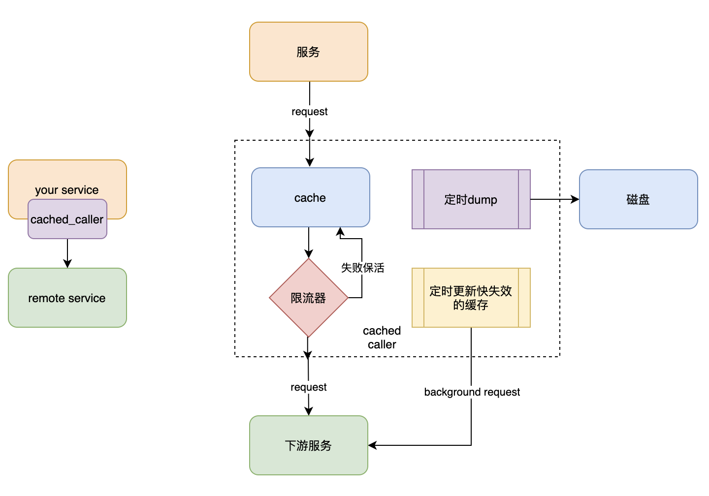

# cached caller
对远程调用包一层缓存，起到加速本地计算保护下游的目的

## scenario
- 请求量巨大，结果更新不频繁
- 低延时，高可用
- 数据一致性要求不高

## design

## feature
- [x] 失败超时限流
- [x] 缓存失效保活
- [x] 缓存异步主动拉取
- [x] 插件化配置缓存、限流器和编解码器
- [ ] 缓存dump+预热

## api
- 参考api.go